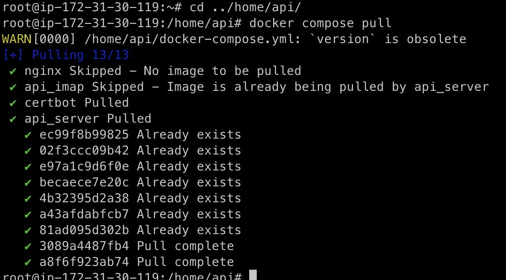

## References

This is an attempt to combine multiple architectural patterns and styles together.
<br> 아래의 오픈소스를 기반으로 DDD, CQRS 패턴을 적용하고 있습니다.

- <a href="https://github.com/Sairyss/domain-driven-hexagon">https://github.com/Sairyss/domain-driven-hexagon<a/>

- Tips
  - Create, Update, Delete는 Aggregate 단위로 이루어지며 Query(조회)는 어떤 방식이든 상관없습니다.
  - 관심사의 분리를 위해 변경이 적고 중요도가 떨어진다면 데이터 중복을 허용합니다. (트레이드 오프)
  - 관심사 분리를 위해 사용할수 있는 것
    - Domain Service
    - Domain Event
  - 응용 서비스에서 여러 Aggregate의 Repository를 참조할수 있습니다.

## Installation

```bash
$ pnpm install
$ pnpm dlx prisma generate
```

## Running the app

```bash
# development
$ pnpm run start

# watch mode
$ pnpm run start:dev

# production mode
$ pnpm run start:prod
```

## Test

현재는 테스트 코드가 없습니다, 대신 Postman 자동 생성이 가능합니다.

- <a href="https://ojware.atlassian.net/wiki/spaces/SD/pages/20447248/Swagger">https://ojware.atlassian.net/wiki/spaces/SD/pages/20447248/Swagger</a>

```bash

```

## Database

테이블 추가/수정하기
저는 현재 이렇게 사용하고있는데 더 좋은 방법이 있으면 알려주세요.

DB에 접속하여 직접 테이블을 추가/수정 합니다.
그 후 prisma 명령어를 실행합니다.

```
pnpm dlx db pull
pnpm dlx generate
```

## Nginx

(서버 배포용, 로컬에서는 필요 없움)

nginx 폴더와 docker-compose.yml 파일들을 한단계 상위 폴더로 복사합니다.

```bash
cp -r nginx ../
cp docker-compose.yml ../
cp docker-compose.ssl.dry-run.yml ../
cp docker-compose.ssl.yml ../
cd ../
```

ssl 인증서를 발급합니다.

```bash
docker compose -f docker-compose.ssl.dry-run.yml up # 성공했다면 아래 코드 실행
docker compose -f docker-compose.ssl.yml up # ssl 인증서 발급
```

prod, dev 각 프로젝트 폴더가 잘 구성 되어있는지 확인하고 실행시킵니다.

```bash
docker compose up --build
```

## CQRS Code Generator

book store라는 도메인으로 cqrs 패턴 포맷의 모듈 생성 (포맷이 완벽하지 않아서 사용할때 약간의 수정이 필요할 수 있습니다.)

```
pnpm cqrs:generate init book-store
```

# Domain documents

- <a href="https://baruncorp.com/">https://baruncorp.com/<a/>
  <br> BarunCorp는 태양광 발전기 설치를 위한 설계, 설계 검토를 해주는 회사입니다.

- 해당 시스템은 클라이언트와 직원들이 함께 사용하는 <b>주문 & 프로젝트 관리 시스템</b>입니다.

1. 고객의 주문을 접수합니다.
2. 주문을 관리합니다.
3. 주문에 관련된 직원의 작업들을 관리합니다.
4. 직원들을 관리합니다.

### Ubiquitous Languages

#### Project, Ordered Job, Ordered Service

- Project: 태양광 발전기를 설치 프로젝트, 주요 정보는 설치 주소다.
  - (주소에 따라서 해당 주소의 관련 법들이 매칭되어야하므로 중요한 정보다.)
  - Project Property Type: Residential(가정용), Commercial(상업용)
- Ordered Job: 프로젝트에서 관리되는 주문 단위이다.
  - Job 1 = 프로젝트의 첫번째 주문
  - Mounting Type: Roof Mount(RM), Ground Mount(GM) GM이 가격이 더 비싸다. (설치가 더 어려운듯?)
- Ordered Service: Job을 생성할때 선택했던 service들이다.
  - 처음 주문된 Service는 New 타입으로 불린다.
  - 두번째 주문된 Service 부터는 Revision이 된다.

#### Price vs GM Price

GM은 Ground Mount를 의미한다, 프로젝트의 설치 타입에는 Roof Mount, Ground Mount, 또는 두가지를 혼용하는 경우가 있는데
Grount Mount 유형의 경우 비용을 더 많이 받기때문에 GM Price라는 가격 필드가 따로 있다.

### 도커 이미지 배포하기

<b>이미지 빌드하기</b>
docker build --platform linux/amd64 -t luckyhyom/barun-api-prod .
<b>이미지 배포하기</b>
docker push luckyhyom/barun-api-prod

### 도커 이미지 받아오기

ec2에 접속해서 도커 컴포즈 파일이 있는 위치에서 아래 명령어 실행
docker compose pull

